# Communication Systems: A Beginner's Guide

A guide, in basic terms, to how information travels from one place to another, from a phone call to a Wi-Fi signal to an RFID card tap.

---

## Table of Contents

1. [What is Communication?](#1-what-is-communication)
2. [What Makes Up a Communication System?](#2-what-makes-up-a-communication-system)
3. [Basic Block Diagram of a Communication System](#3-basic-block-diagram-of-a-communication-system)
4. [How Is Anything Transmitted and Received?](#4-how-is-anything-transmitted-and-received)
5. [Modulation: What and Why](#5-modulation-what-and-why)
6. [Types of Modulation](#6-types-of-modulation)
7. [Demodulation (AM, FM, PM)](#7-demodulation-am-fm-pm)
8. [Wired Communication](#8-wired-communication)
9. [Wireless Communication](#9-wireless-communication)
10. [GNU Radio](#10-gnu-radio)
11. [HackRF One](#11-hackrf-one)
12. [RFID](#12-rfid)
13. [Antenna](#13-antenna)
14. [Quick Glossary](#14-quick-glossary)
15. [Safety and Legal Note](#15-safety-and-legal-note)

---

## 1. What is Communication?

**Communication** means sending information (voice, video, text, data) from one place to another.

The field that studies and builds the systems that do this is called **communications engineering** (often shortened to *comms*). It sits where electronics, signal processing, and networking meet. When you:

- make a phone call
- watch TV
- listen to FM radio
- use Wi-Fi or Bluetooth
- tap a metro card

...you are using communication systems.

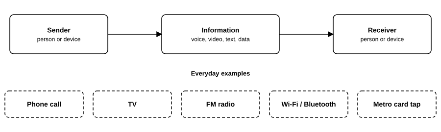

*Figure 1: Communication is information moving from a sender to a receiver.*

**In one line:** *Communication = how we carry information from a sender to a receiver, correctly and reliably, using electrical, radio, or light signals.*

---

## 2. What Makes Up a Communication System?

| Area | In basic terms | Examples |
|---|---|---|
| **Signals** | The "carrier" of information (voltage, radio wave, light) | Voice signal, video signal |
| **Transmitter** | Prepares and sends the signal | Radio station, phone |
| **Channel / Medium** | The path the signal travels through | Wire, fiber, air |
| **Receiver** | Catches the signal and recovers the information | Radio, TV, phone |
| **Modulation / Demodulation** | Putting information on a wave and taking it back out | AM, FM, PM |
| **Noise** | Unwanted disturbance | Static, hiss |
| **Antennas** | Send/catch radio waves | Phone antenna, Wi-Fi router antenna |
| **Coding** | Making data safe and efficient | Error correction, compression |
| **Protocols** | The agreed rules for how devices format, send, and check data | Wi-Fi, Bluetooth, UART, I2C, RFID framing |
| **Networking** | Many devices talking together | Internet, mobile network |
| **Wired Communication** | Over cables | Ethernet, fiber |
| **Wireless Communication** | Through air/space | Wi-Fi, 4G/5G, Bluetooth, satellite |
| **Tools** | Software and hardware to build and test | GNU Radio, HackRF, oscilloscope |
| **Short-range ID tech** | Tag/card communication | RFID, NFC |

---

## 3. Basic Block Diagram of a Communication System

Every communication system, basic or advanced, follows this pattern:

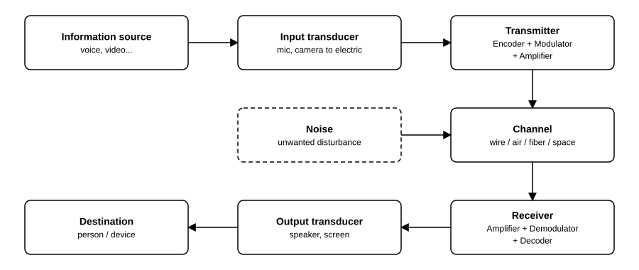

*Figure 2: Basic block diagram of a communication system.*

### What each block does (in basic terms)

| Block | Job | Everyday example |
|---|---|---|
| **Information source** | Where the message starts | Your voice |
| **Input transducer** | Converts the message into an electrical signal | Microphone |
| **Transmitter** | Makes the signal strong and suitable for travel | Phone's radio section |
| **Channel** | The road the signal travels on | Air, cable |
| **Noise** | Spoils the signal along the way | Crackling sound |
| **Receiver** | Picks the signal up and cleans it | Your phone's receiver |
| **Output transducer** | Converts the electrical signal back to sound/picture | Speaker, display |
| **Destination** | The person who gets the message | The listener |

---

## 4. How Is Anything Transmitted and Received?

Let's follow **one phone call** step by step.

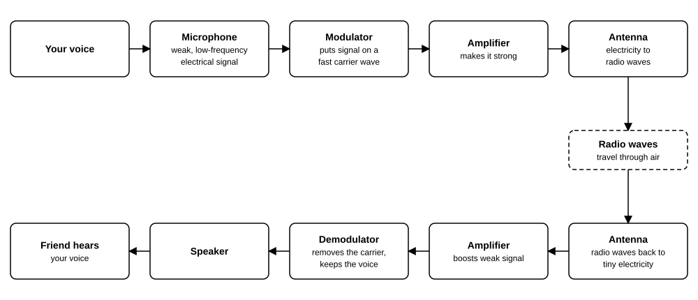

*Figure 3: Signal path of one phone call, from voice to listener.*

**Why can't we just send voice directly through the air?**

- Voice signals are **low frequency** (20 Hz to 20 kHz). To radiate low frequencies efficiently you'd need antennas **many kilometres long**.
- Everyone's voice would **mix together** on the same frequencies.

The solution is **modulation**: shift the message onto a high-frequency carrier. Antennas become small, and each station gets its own frequency.

---

## 5. Modulation: What and Why

### What is modulation?

> **Modulation** = changing some property of a high-frequency wave (the **carrier**) according to the message (the **message signal**).

Think of it like this:

- The **carrier** is a truck.
- The **message** is the parcel.
- Modulation = loading the parcel on the truck so it can travel far.

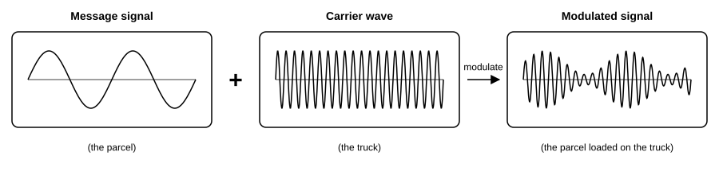

*Figure 4: Modulation: the message (parcel) is loaded onto the carrier (truck).*

A carrier wave has three properties you can change:

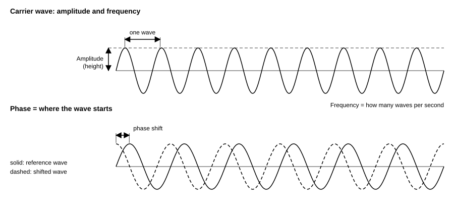

*Figure 5: A carrier wave has an amplitude (height), a frequency (waves per second) and a phase (where the wave starts).*

| Property changed | Modulation name |
|---|---|
| Amplitude | **AM** (Amplitude Modulation) |
| Frequency | **FM** (Frequency Modulation) |
| Phase | **PM** (Phase Modulation) |

### Why do we need modulation?

1. **Smaller antennas** (high frequency means a short antenna)
2. **Many stations at once** (each uses a different carrier frequency)
3. **Longer range**
4. **Less noise and interference** (especially FM)

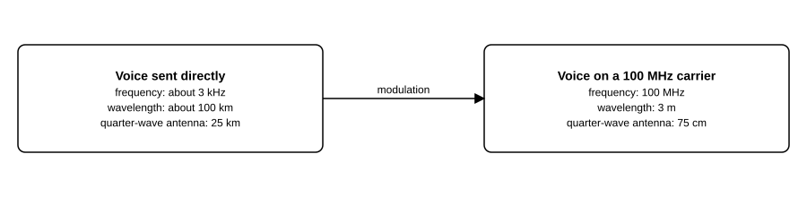

*Figure 6: Smaller antennas: a 3 kHz voice needs about 25 km of antenna; on a 100 MHz carrier about 75 cm.*

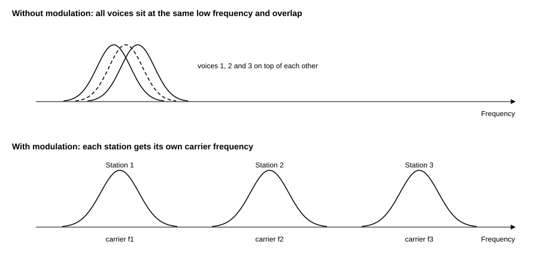

*Figure 7: Many stations at once: each station gets its own carrier frequency.*

### Block diagram of a modulator

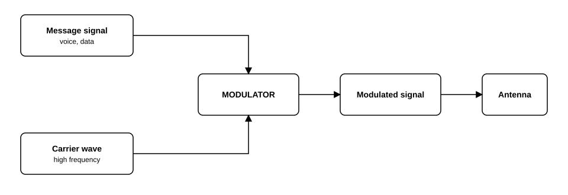

*Figure 8: Block diagram of a modulator.*

---

## 6. Types of Modulation

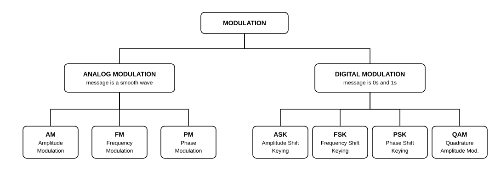

*Figure 9: Types of modulation.*

### 6.1 AM, Amplitude Modulation

The **height (amplitude)** of the carrier changes with the message. Frequency stays the same.

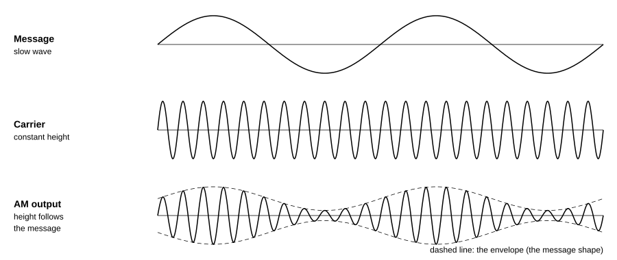

*Figure 10: AM: the height of the carrier follows the message; the frequency stays the same.*

- Basic, cheap, long range (used in AM radio, aviation)
- Easily affected by noise

### 6.2 FM, Frequency Modulation

The **frequency** of the carrier changes with the message. Amplitude stays the same.

When the message is high, the carrier waves get closer together (higher frequency). When it is low, they spread apart (lower frequency).

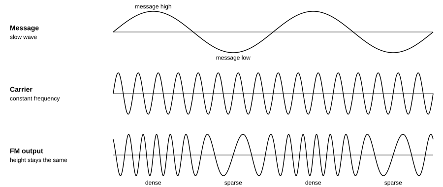

*Figure 11: FM: the frequency of the carrier follows the message; the height stays the same.*

- Very good sound quality, resists noise
- Needs more bandwidth than AM
- Used in: FM radio (88-108 MHz), walkie-talkies

### 6.3 PM, Phase Modulation

The **phase** (starting position/timing) of the carrier shifts according to the message.

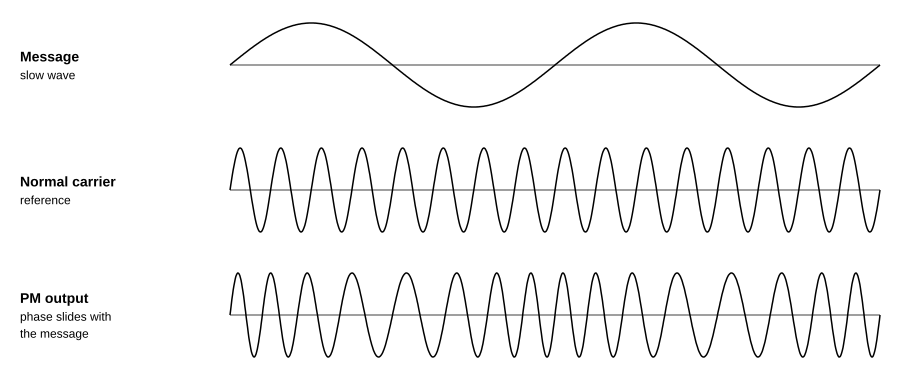

*Figure 12: PM: the phase of the carrier slides sideways as the message changes.*

- PM is closely related to FM, since changing phase also changes the frequency.
- Used in: many digital systems (PSK), satellite links, Wi-Fi

### 6.4 Digital modulation (quick look)

The message here is **0s and 1s**.

| Name | Full form | What changes | In layman's terms |
|---|---|---|---|
| **ASK** | Amplitude Shift Keying | Wave height: big = 1, small/none = 0 | On/Off |
| **FSK** | Frequency Shift Keying | Frequency: high = 1, low = 0 | Two tones |
| **PSK** | Phase Shift Keying | Phase: 0 degrees = 0, 180 degrees = 1 | Flip the wave |
| **QAM** | Quadrature Amplitude Modulation | Amplitude + Phase together | More bits per symbol (Wi-Fi, 4G/5G, cable TV) |

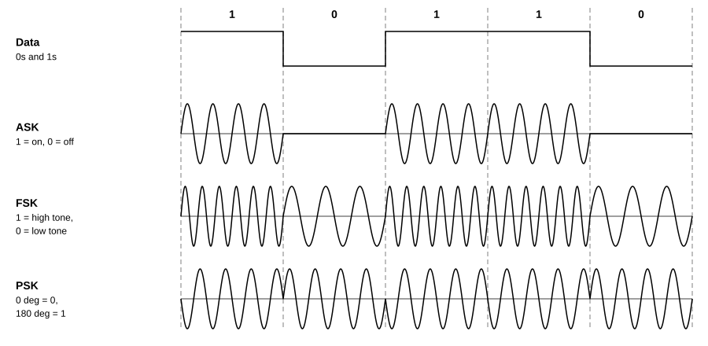

*Figure 13: Digital modulation of the bits 1 0 1 1 0 using ASK, FSK and PSK.*

---

## 7. Demodulation (AM, FM, PM)

> **Demodulation** = the reverse of modulation. The receiver removes the carrier and recovers the original message.

General block diagram of a receiver:

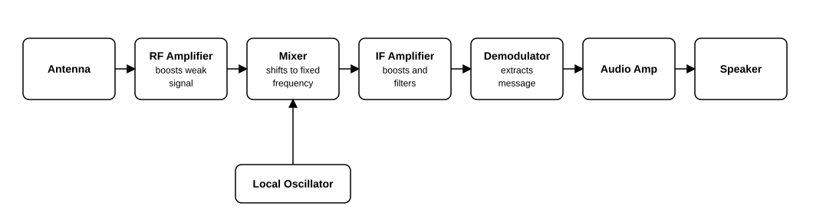

*Figure 14: Superheterodyne receiver.*

This is called a **superheterodyne receiver**, which is used in almost all radios.

### 7.1 AM Demodulation

**Idea:** The message is hidden in the *height* of the wave, so trace the top outline (the "envelope").

**Envelope detector** (the most basic method):

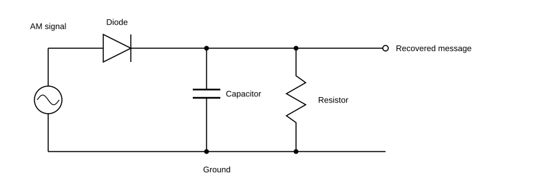

*Figure 15: Envelope detector: a diode, then a capacitor and resistor to ground.*

How it works in layman's terms:

1. **Diode** lets only the top half of the wave pass.
2. **Capacitor + Resistor** smooth out the fast carrier bumps.
3. What remains is the **outline**, which is your original message.

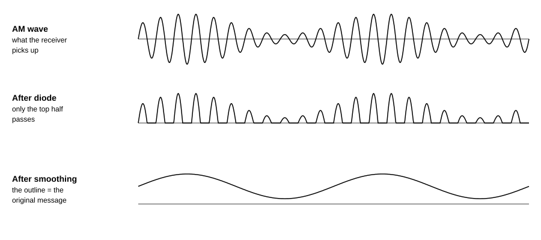

*Figure 16: Envelope detection in three stages: AM wave, after the diode, after smoothing.*

Other method: **Synchronous (coherent) detector**. Multiply the signal by a locally generated carrier, then low-pass filter. This is more accurate but more complex.

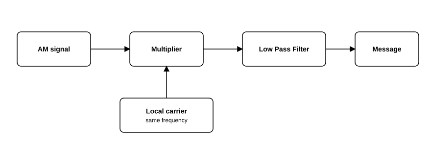

*Figure 17: Synchronous (coherent) AM detector.*

### 7.2 FM Demodulation

**Idea:** The message is hidden in the *frequency changes*, so we must convert frequency changes into voltage changes.

**Common methods:**

| Method | In layman's terms |
|---|---|
| **Slope detector** | A tuned circuit that gives more output for higher frequency, so frequency variations turn into height variations. Then an envelope detector finishes the job. |
| **Foster-Seeley / Ratio detector** | Uses two coupled coils and diodes; output depends on the frequency's distance from the centre. |
| **PLL (Phase-Locked Loop) detector** | A circuit that "locks" onto the incoming frequency; the control voltage it uses *is* the message. |
| **Quadrature detector** | Compares the signal with a 90-degree delayed copy; output changes with frequency. |

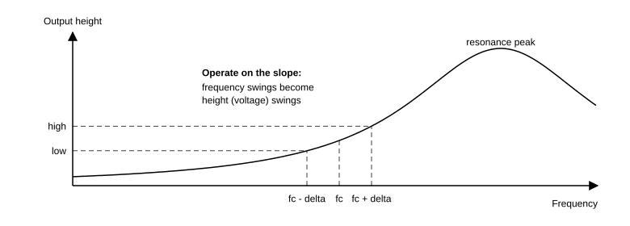

*Figure 18: Slope detector: frequency swings become height swings on the side of a tuned circuit's curve.*

**PLL-based FM demodulator (most popular today):**

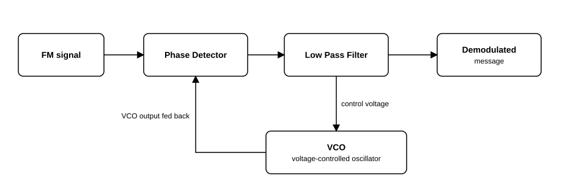

*Figure 19: PLL-based FM demodulator.*

How it works: the VCO tries to copy the incoming frequency. To keep up, its control voltage must rise and fall exactly like the original message. We tap that voltage as the output.

### 7.3 PM Demodulation

**Idea:** The message is hidden in *phase shifts*, so compare the incoming phase with a reference carrier.

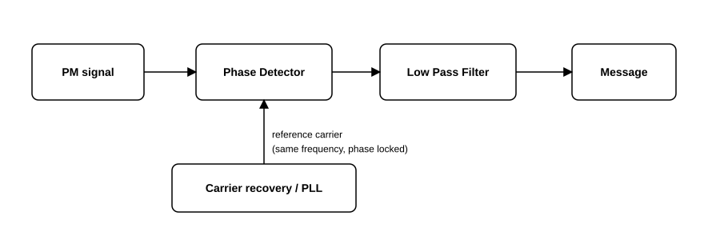

*Figure 20: PM demodulator.*

- A **PLL** or a **coherent detector** is used.
- Because phase is relative, the receiver must lock to the carrier first.
- For digital PSK, the receiver looks at which phase each symbol has and decides 0 or 1.

### 7.4 Summary table

| Modulation | What carries the message | Common demodulator |
|---|---|---|
| **AM** | Amplitude (height) | Envelope detector, synchronous detector |
| **FM** | Frequency | Slope / Ratio / Quadrature / PLL |
| **PM** | Phase | Phase detector with PLL / coherent detector |

---

## 8. Wired Communication

Signals travel through a **physical cable**.

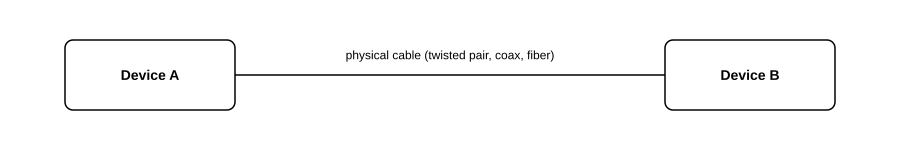

*Figure 21: A wired communication link.*

### Types of wired communication

| Type | What it is | Where it's used | Speed / Notes |
|---|---|---|---|
| **Twisted pair** | Two copper wires twisted together to reduce noise | Telephone lines, Ethernet (LAN cables) | Cheap, short-to-medium range |
| **Coaxial cable** | Centre wire + insulation + metal shield | Cable TV, CCTV, antenna cables | Better shielding, higher bandwidth |
| **Optical fiber** | Glass/plastic thread carrying **light** pulses | Internet backbone, undersea cables | Very fast, long distance, immune to electrical noise |
| **Power-line communication** | Data over electrical power wiring | Smart meters | Uses existing wiring |
| **Serial / bus cables** | Short device-to-device links | USB, UART, SPI, I2C, HDMI | Inside gadgets and computers |

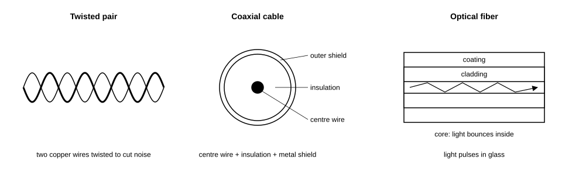

*Figure 22: Twisted pair, coaxial cable and optical fiber.*

**Pros:** stable, secure, less interference.
**Cons:** cables are costly to install, and devices can't move freely.

---

## 9. Wireless Communication

Signals travel through **air or space** as electromagnetic waves, with no cable needed.

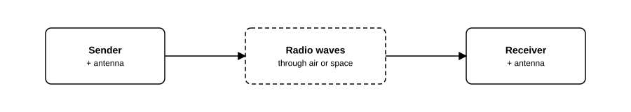

*Figure 23: A wireless communication link.*

### Types of wireless communication

| Type | Typical frequency | Range | Example |
|---|---|---|---|
| **AM/FM broadcast radio** | 530 kHz-1.7 MHz (AM), 88-108 MHz (FM) | Tens of km | Radio stations |
| **TV broadcast** | VHF/UHF | Tens of km | Terrestrial TV |
| **Cellular (2G/3G/4G/5G)** | 700 MHz to 40 GHz | Few km per tower | Mobile phones |
| **Wi-Fi** | 2.4 / 5 / 6 GHz | ~10-100 m | Home internet |
| **Bluetooth** | 2.4 GHz | ~10 m | Earbuds, speakers |
| **Zigbee / LoRa** | Sub-GHz / 2.4 GHz | 10 m to many km | IoT sensors |
| **NFC / RFID** | 13.56 MHz, 125 kHz, 860-960 MHz | cm to metres | Cards, tags |
| **Satellite** | 1-40 GHz | Global | GPS, DTH TV, satellite phones |
| **Microwave link** | 1-40 GHz | Line-of-sight, tens of km | Tower to tower links |
| **Infrared (IR)** | Light (not radio) | A few metres | TV remote |

### Wired vs Wireless (quick comparison)

| | Wired | Wireless |
|---|---|---|
| Mobility | Fixed | Free to move |
| Speed stability | Very stable | Varies with distance, walls, interference |
| Security | Harder to intercept | Needs encryption |
| Installation | Needs cabling | Quick setup |

### The radio spectrum

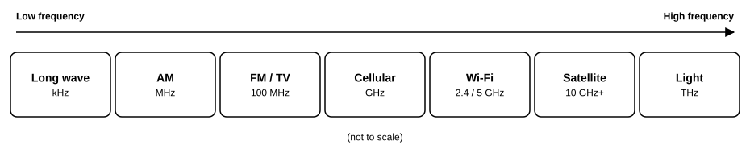

*Figure 24: The radio spectrum (not to scale).*

---

## 10. GNU Radio

### What is it?

**GNU Radio** is a free, open-source software toolkit to build radio systems **using software instead of hardware**. This approach is called **SDR (Software Defined Radio)**.

> Think of it like **LEGO for radio**. You drag and drop blocks (filters, modulators, demodulators), connect them with lines, and press Run.

### Why use it?

- Learn how modulation and demodulation actually work (you can *see* the signals)
- Build and test AM/FM receivers without soldering
- Decode real signals using hardware like HackRF or RTL-SDR
- Experiment safely using only simulated signals

### How it works: flowgraph

You build a **flowgraph**, which is a chain of blocks:

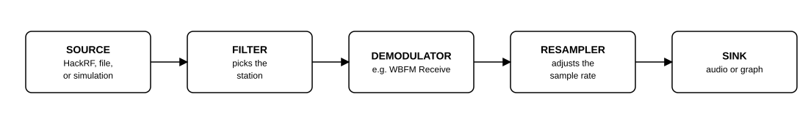

*Figure 25: A generic GNU Radio flowgraph.*

### Example: Basic FM Radio Receiver in GNU Radio

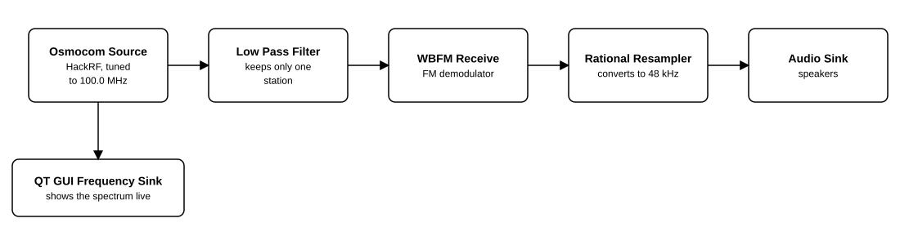

*Figure 26: Basic FM receiver in GNU Radio.*

**Steps:**

1. Install GNU Radio (on Ubuntu/Debian, run: sudo apt install gnuradio).
2. Open **GNU Radio Companion (GRC)**, the drag-and-drop editor.
3. Add the blocks above, connect them, set the centre frequency (e.g. 100.0e6, which means 100 MHz).
4. Click **Run** and listen to FM radio.

### Common block types

| Block type | Example blocks | Job |
|---|---|---|
| **Sources** | Osmocom Source, Signal Source, File Source | Where signals come from |
| **Filters** | Low Pass Filter, Band Pass Filter | Keep wanted frequencies |
| **Modulators / Demodulators** | AM Demod, WBFM Receive, PSK Mod | Add or remove the message |
| **Math** | Multiply, Add, Throttle | Combine and scale signals |
| **Sinks** | Audio Sink, QT GUI Time/Frequency/Waterfall Sink | Output or visualise |

---

## 11. HackRF One

### What is it?

**HackRF One** is a low-cost **SDR hardware device** (it looks like a small USB stick with antenna ports) that can **receive and transmit** radio signals across a very wide range.

| Feature | Value |
|---|---|
| Frequency range | About **1 MHz to 6 GHz** |
| Mode | **Half-duplex** (receive *or* transmit, not both at once) |
| Sample rate | Up to **20 MS/s** |
| Interface | USB 2.0 |
| Open source | Yes, hardware and software |

### How it fits in the system

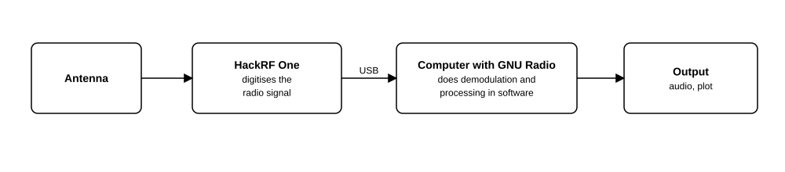

*Figure 27: HackRF One in the signal chain.*

**In layman's terms:** HackRF catches radio waves and turns them into numbers. GNU Radio then does the maths (filtering, demodulating) to turn those numbers back into sound, data, or pictures.

### What can you do with it? (Receiving)

- Listen to FM radio and other broadcasts
- Receive aircraft ADS-B position signals
- Receive weather satellite images (NOAA APT)
- Study how car key fobs, sensors, and remotes (433 MHz) work, *on your own devices*
- Explore the radio spectrum and learn how signals look

### Basic setup

1. Install the tools by running: sudo apt install hackrf gnuradio gr-osmosdr
2. Check that the device is detected by running: hackrf_info

In GNU Radio, use the **Osmocom Source** block and choose HackRF as the device.

---

## 12. RFID

### What is RFID?

**RFID = Radio Frequency IDentification.** It identifies an object or person using a small **tag** and a **reader**, with no touch or line of sight needed.

Examples: metro/bus cards, office access badges, toll tags (FASTag), library books, warehouse stock tracking, pet microchips.

### Block diagram

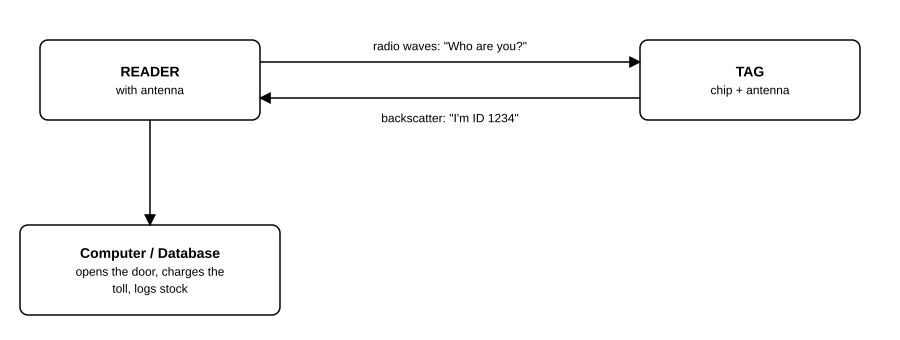

*Figure 28: RFID reader and tag exchange.*

### Parts of RFID

| Part | What it is |
|---|---|
| **Tag** | A tiny chip (stores an ID) plus an antenna |
| **Reader** | Sends radio waves and reads the reply |
| **Antenna** | Used by both tag and reader to send and catch waves |
| **Backend system** | Software/database that uses the ID |

### How does it work? (step by step, in basic terms)

1. The **reader** sends out a radio signal.
2. The tag's **antenna catches that energy**.
3. In **passive tags**, this energy powers the chip, so no battery is needed!
4. The chip replies with its stored ID by slightly changing how it reflects the signal (called **backscatter**).
5. The reader decodes the ID and passes it to the computer.

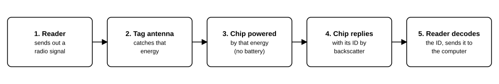

*Figure 29: How RFID works, step by step.*

### Types of tags

| Type | Power | Range | Notes |
|---|---|---|---|
| **Passive** | None (powered by reader) | cm to ~10 m | Cheapest, most common |
| **Active** | Own battery | Up to 100 m+ | Used for vehicles, containers |
| **Semi-passive** | Battery for chip, reader for talking | Medium | Used for sensors |

### Frequency bands

| Band | Frequency | Range | Example use |
|---|---|---|---|
| **LF** | 125-134 kHz | ~10 cm | Pet chips, old access cards |
| **HF** | 13.56 MHz | ~10 cm to 1 m | Metro cards, NFC, library |
| **UHF** | 860-960 MHz | Up to ~10 m | Toll tags, warehouse tracking |

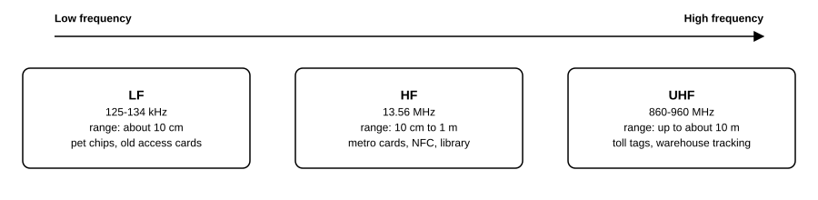

*Figure 30: RFID frequency bands: LF, HF and UHF.*

> **NFC** (Near Field Communication) is a special short-range form of HF RFID (13.56 MHz) used in phone tap-to-pay.

### Learning tip

You can see RFID signals in GNU Radio with an SDR (HackRF), which is a good way to **learn** how ASK and backscatter modulation look. Only work with **your own tags** and cards.

---

## 13. Antenna

### What is an antenna?

An **antenna** is a piece of metal (wire, rod, plate) that:

- **When transmitting:** converts electrical signals into radio waves
- **When receiving:** converts radio waves back into electrical signals

> Think of an antenna as the **"mouth and ears"** of a wireless system.

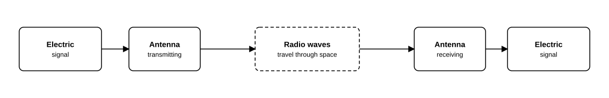

*Figure 31: An antenna at each end of a wireless link.*

### Why is it needed?

Without an antenna, the signal would stay stuck inside the wire. The antenna lets energy **leave into space** and lets the receiver **catch it** again.

### Key points (in basic terms)

| Term | Meaning |
|---|---|
| **Length matters** | An antenna works best when its length matches the wavelength. A common size is **half or quarter of the wavelength**. |
| **Wavelength** | Wavelength = speed of light divided by frequency = **300 / f(MHz)** metres |
| **Gain** | How much the antenna focuses energy in one direction (higher gain = stronger in that direction) |
| **Directivity** | Does it send in all directions or one? |
| **Polarisation** | The orientation of the wave (vertical/horizontal), and both antennas should match |
| **Impedance (50 ohm)** | The antenna should match the cable and radio to avoid wasted power |
| **Bandwidth** | The range of frequencies the antenna works well on |

**Example:** For FM at 100 MHz, wavelength = 300/100 = **3 m**, so a quarter-wave antenna is about **75 cm**.

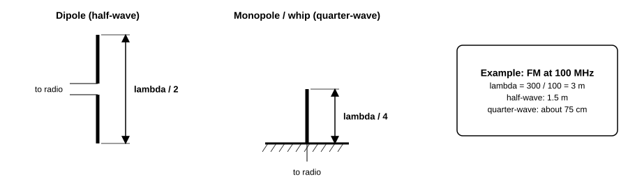

*Figure 32: A dipole is half a wavelength long; a monopole is a quarter wavelength.*

### Common types of antennas

| Antenna | Shape | Direction | Where it's used |
|---|---|---|---|
| **Dipole** | Two straight rods | Sideways, all around | FM radio, basic testing |
| **Monopole / Whip** | Single rod on ground | All around (omni) | Car radios, walkie-talkies |
| **Yagi-Uda** | Rod with several elements | One direction (high gain) | Rooftop TV antenna |
| **Parabolic dish** | Curved dish | Very narrow beam | Satellite TV, microwave links |
| **Patch / Microstrip** | Flat metal square on board | Forward | Phones, GPS, Wi-Fi modules |
| **Loop** | Wire loop | Depends on size | AM radio, RFID, NFC |
| **Helical** | Spring/coil shape | Forward (circular) | Satellite tracking |

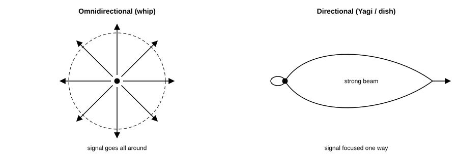

*Figure 33: Omnidirectional (signal goes all around) vs directional (signal focused one way).*

### Basic tips

- Use the **right antenna for the frequency**. A TV antenna won't work well for Wi-Fi.
- **Higher and clear of obstacles** = better signal.
- With HackRF, always attach a suitable antenna before transmitting, to protect the hardware.

---

## 14. Quick Glossary

| Term | In basic terms |
|---|---|
| **Signal** | Changing voltage/wave that carries information |
| **Carrier** | A high-frequency wave that carries the message |
| **Message / Baseband** | The original information (voice, data) |
| **Frequency (Hz)** | How many wave cycles per second |
| **Bandwidth** | How much frequency space a signal needs |
| **Noise** | Unwanted random disturbance |
| **SNR** | Signal-to-Noise Ratio, meaning how strong the signal is compared to noise |
| **Channel** | The path/medium of communication |
| **Modulation** | Putting a message onto a carrier |
| **Demodulation** | Taking the message back out |
| **SDR** | Software Defined Radio, where radio functions are done in software |
| **RF** | Radio Frequency |
| **Transducer** | Converts one form of energy to another (mic, speaker) |
| **Spectrum** | The range of all radio frequencies |
| **PLL** | Phase-Locked Loop, a circuit that locks onto a signal's frequency/phase |

---

## 15. Safety and Legal Note

- **Receiving** is generally fine for learning, but laws on intercepting certain private communications (calls, encrypted data) differ by country.
- **Transmitting** radio signals without a licence on many frequencies is **illegal** (emergency, aviation, cellular, and broadcast bands especially). It can cause harmful interference.
- For safe practice: use **simulated signals** in GNU Radio, use **shielded or low-power setups**, stay within **licence-free (ISM) bands** and permitted power limits, and only experiment with **your own devices**.
- Check your local radio regulations (in India, the **WPC / DoT** rules).
